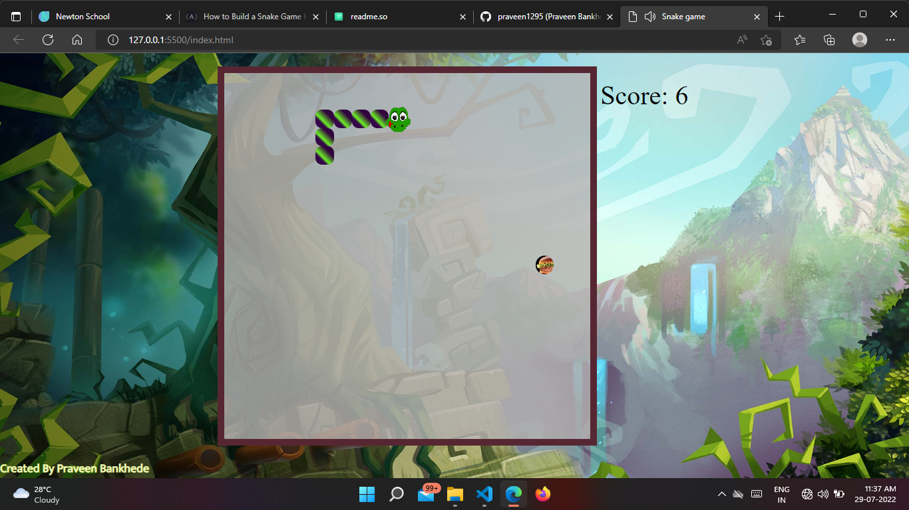

# Javascript Snake Game

## Description

A snake game is a simple game where a snake moves inside a box trying to eat an apple. Once it successfully eats the apple, the length of the snake increases.

### How to Play

- Use the arrow keys to move the snake
- Collect the apple to get points
- the game is over when the snake runs into itself or any of the four walls of the box.
- if your snack not runs itself or any of the four walls of the box than you can mak high score.
- Try to get the most points without touching itself or any of the four walls of the box.

## About this Project

Snake Game created only with html, css and javascript inspired by the old mobile games.

Email-me: bankhedepraveen12@gmail.com

Connect with me at [Linkedin](https://www.linkedin.com/in/praveen1295/)

### Running

Just open index.html in your browser and play.

## Built With

Only HTML, CSS and JS.
## Screenshots

## Deployment

the web app is deployed using Netlify. Live Link URL : https://splendorous-fudge-edf422.netlify.app

## Authors

- [@Praveen Bankhede](https://github.com/praveen1295)

